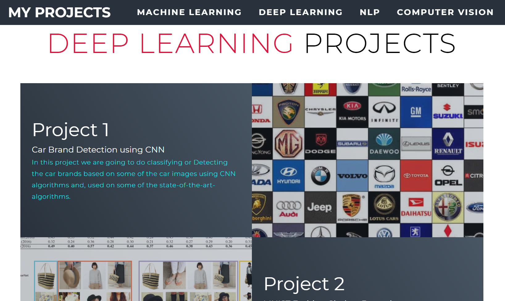
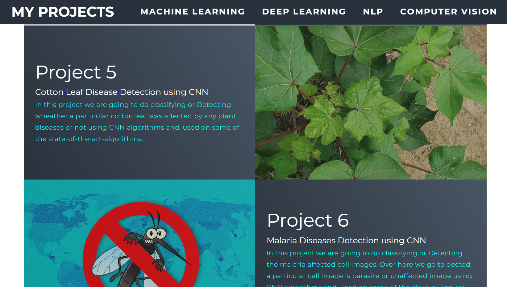
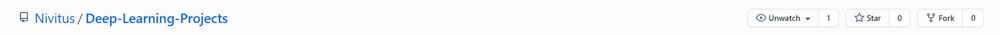
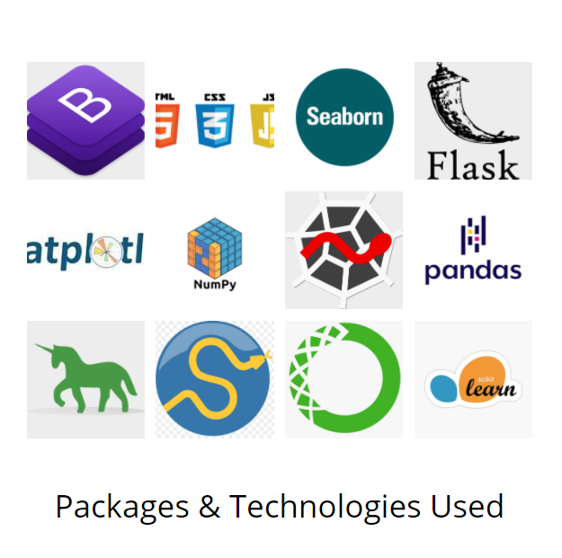

# Deep-Learning-Projects
## Table of Content ##
- [Demo](#demo)
- [Overview](#overview)
- [Motivation](#motivation)
- [Projects Done](#projects-done)
- [Upcoming Projects](#upcoming-projects)
- [Technical Aspects](#technical-aspects)
- [Installation](#installation)
- [Run](#run)
- [Deployment on Heroku](#deployment-on-heroku)
- [Directory Tree](#directory-tree)
- [To Do](#to-do)
- [Bug / Feature Request](#bug--feature-request)
- [Technologies Used](#technologies-used)
- [Team](#team)
- [License](#license)
- [Credits](#credits)
## Demo
- App Link : <a href="http://nivitus.herokuapp.com/page.html#dlprojects" target="_blank">Deep Learning Projects</a>

[](http://nivitus.herokuapp.com/page.html#dlprojects)
[](http://nivitus.herokuapp.com/page.html#dlprojects)

## Overview
In this [repository](https://github.com/Nivitus/Deep-Learning-Projects) consists of various Deep learning projects in which each projects was done. But deploying part will bw in future. Over here all Deep learning projects from Data Collection through feature engineering, feature selecion to Deployment and Maintainance. The whole app was built with Flask framework. You can launch my app by clicking <a href="https://nivitus.herokuapp.com/page.html#dlprojects" target="_blank">here</a>.

For building machine learning models, I have used scikit-learn alias sklearn. The model was deployed on Heroku platform which is a platform-as-a-service.

## Motivation
When I finsihed my Machine Learning Stuffs I got some confused about Machine Learning is enough for getting AI or Data Science Jobs. At the time I was heard about Deep learning is most import for build super AI projects. As well as when I was searched about Deep learning a google came up with wondrefull inspration for me. As well I'm so intrested to working Self-Driving cars and Computer Vision problems. So i decided to learn Deep Learning from scratch like maths to code..

## Projects Done
Here I have listed all the projects that I have done and strats from latest projects.

| Project No |          Project Name           |  Start Date  |   End Date  |           GitHub          |         Blog          | App Link |
|:-----------|:--------------------------------|:------------:|:-----------:|--------------------------:|----------------------:|---------:|
| 1.         | Cat or Dog Classification in CNN | 10-Oct-2020  | 15-Oct-2020 |[Cat or Dog](https://github.com/Nivitus/Deep-Learning-Projects/tree/master/Cat%20or%20Dog)|-|-|
| 1.         | Cat or Dog Classification in CNN | 10-Oct-2020  | 15-Oct-2020 |[Cat or Dog](https://github.com/Nivitus/Deep-Learning-Projects/tree/master/Cat%20or%20Dog)|-|-|
| 1.         | Cat or Dog Classification in CNN | 10-Oct-2020  | 15-Oct-2020 |[Cat or Dog](https://github.com/Nivitus/Deep-Learning-Projects/tree/master/Cat%20or%20Dog)|-|-|
| 1.         | Cat or Dog Classification in CNN | 10-Oct-2020  | 15-Oct-2020 |[Cat or Dog](https://github.com/Nivitus/Deep-Learning-Projects/tree/master/Cat%20or%20Dog)|-|-|
| 1.         | Cat or Dog Classification in CNN | 10-Oct-2020  | 15-Oct-2020 |[Cat or Dog](https://github.com/Nivitus/Deep-Learning-Projects/tree/master/Cat%20or%20Dog)|-|-|
| 1.         | Cat or Dog Classification in CNN | 10-Oct-2020  | 15-Oct-2020 |[Cat or Dog](https://github.com/Nivitus/Deep-Learning-Projects/tree/master/Cat%20or%20Dog)|-|-|
| 1.         | Cat or Dog Classification in CNN | 10-Oct-2020  | 15-Oct-2020 |[Cat or Dog](https://github.com/Nivitus/Deep-Learning-Projects/tree/master/Cat%20or%20Dog)|-|-|
## Upcoming Projects
| Project No |          Project Name           |  Start Date  |   End Date  |           GitHub          |         Blog          | App Link |
|:-----------|:--------------------------------|:------------:|:-----------:|--------------------------:|----------------------:|---------:|
| 12.         | Bitcoin Price Predictor  | 05-Oct-2020  | Present |-||-||-|
| 13.         | Uber Data Analysis | 015-Oct-2020  | Present |-||-||-|


## Technical Aspects
Since we can deploy atmost 5 app in Heroku as a free service, I came up with a new idea of deploying all my projects in a single web app and controlling the each projects navigation with Flask and Python.

Some extra-ordinary features that I have included in my app :
- Visualizing Probability of classifcation in each classification type problems.
- Added all the details about the projects such as data source, code source, libraries and frameworks used in each project's description.
- All my end to end projects in a single view.

## Installation
To run my app on your local machine, do the following steps.
> **Step 1** : 
   - I have written the Code with Python 3.7.7. If you don't have Python installed you can find it [here](https://www.python.org/downloads/release/python-377/).
   - If you are using a lower version of Python you can upgrade using the pip package, kindly ensure that you have the latest version of pip.
> **Step 2** :
   - If you want the current version of my repository to be in your github, you can do forking my repository by clicking as shown in the picture below.
   
   [](https://github.com/Nivitus/Machine-Learning-Projects)

   
   - Clone my repository to your local machine by running the following command. Before doing this, you have to install git on your machine and make sure you are having proper internet connection.
      - For **Windows OS** user, open *git bash* and run the following command.
      ```bash
      git clone https://github.com/Nivitus/Machine-Learning-Projects.git
      ```
      
      - For **Linus OS** user, open *Terminal* and run the following command.
      ```bash
      git clone https://github.com/Nivitus/Machine-Learning-Projects.git
      ```
   
   - If you don't want to mess up with all these things, you can just download the *zip* file of my GitHub repository by clicking [here](https://github.com/Nivitus/Machine-Learning-Projects/archive/master.zip) and extract it to any file location as your wish and then use it.
   - Now we have done with the downloading of my whole project.

> **Step 3** :
   - After downloading the whole repo, get into the main folder by hit the following command in git bash for Windows OS users and Terminal for Linux OS users.
   ```bash
   cd Machine-Learning-Projects
   ```

> **Step 4** :
   - Now we are going to install all the dependency libraries for this project. Before that you must have Python 3.7.7 and latest version of pip.
   - To install all the dependency libraries in a single command, run the following command.
   
   ```bash
   pip install -r requirements.txt
   ```
   
> **Step 5** :
   - After installing all the dependency libraries, you are ready to run my app on your local machine.
   - To launch my app on your local machine, hit the following command.
   ```bash
   python ml_projects.py
   ```

## Run
- Now you have successfully launched my app on your local machine.
- To view my app, hit the following URL in any of the browser such as Chrome, FireFox, etc..,
   
   ```bash
   http://127.0.0.1:5000/
   ```

## Deployment on Heroku
- After successfully running my app on your local machine, you can also deploy my app on heroku by following the steps given on [Heroku Documentation](https://devcenter.heroku.com/articles/getting-started-with-python). You have to do it on your own risk.
- In case, if you have any issues on deploying the app, please open a new issue by clicking [here](https://github.com/Nivitus/Machine-Learning-Projects/issues/new/choose). Because it may help others while deploying.

## Directory Tree


```bash
Machine-Learning-Projects
├── 01.Iris Flower Classification
├── 02.Car Price Prediction
├── 03.Diabetes Prediction
├── 04.Flight Price Prediction
├── 05.Heart Diseases Prediction
├── 06.Boston House Price Prediction
├── 07.IPL Score Prediction
├── 08.Mobile Price Prediction
├── 09.Loan Prediction
├── 10.Beer Consumptio Prediction


├── data
│   ├── ML_Projects.csv
│   └── social-media-links.csv
├── Demos
├── models
├── py_modules
│   ├── __pycache__
│   └── data_extraction.py
├── static
│   ├── css
│   ├── files
│   ├── images
│   └── js
├── templates
│   ├── index.html
│   ├── indexx.html
│   ├── Iris Flower Classification.html	
│   ├── Car Price Prediction
│   ├── Diabetes Prediction	
│   ├── Flight Price Prediction	
│   ├── Heart Diseases Prediction	
│   ├── Boston House Price Prediction	
│   ├── IPL Score Prediction	
│   ├── Mobile Price Prediction	
│   ├── Loan Prediction	
│   ├── Beer Consumptio Prediction	
├── LICENSE.txt
├── runtime.txt
└── README.md
```


## To Do

These features will be added in the future :
1. Connecting my portfolio app with this project app very soon.
2. Using Exception handling for handling invalid input.
3. Adding a link to the data source in the project description popup modal.
4. Adding GitHub link to each projects in both description popup modal and project page.
5. Adding better visualization charts for classification type problems.
6. Adding visualization for regrerssion type problems.

## Bug / Feature Request

If you find a bug (the website couldn't handle the query and / or gave undesired results), kindly open an issue [here](https://github.com/Nivitus/Machine-Learning-Projects/issues/new) by including your search query and the expected result.

If you'd like to request a new function, feel free to do so by opening an issue [here](https://github.com/Nivitus/Machine-Learning-Projects/issues/new/choose). Please include sample queries and their corresponding results.

## Technologies Used

  


## Team
[](https://nivitus.herokuapp.com/) |
-|
[NIVITUS](https://nivitus.herokuapp.com) |)


## License
   Copyright 2020 Nivitus

   Licensed under the Apache License, Version 2.0 (the "License");
   you may not use this file except in compliance with the License. 
   You may obtain a copy of the License at

       http://www.apache.org/licenses/LICENSE-2.0

   Unless required by applicable law or agreed to in writing, software
   distributed under the License is distributed on an "AS IS" BASIS,
   WITHOUT WARRANTIES OR CONDITIONS OF ANY KIND, either express or implied.
   See the License for the specific language governing permissions and
   limitations under the License.

## Credits
1. Kaggle - I have collected dataset from kaggle for some of the projects such as Loan Status Prediction, Iris Species Classification, Boston House Price Prediction, etc..,
2. Krish Naik -  I have Learned many of the concepts & ideas from his Youtube Channel.


